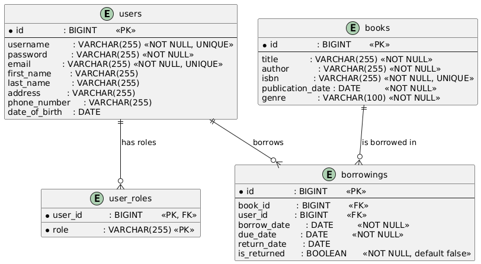

# Getir Bootcamp Library Management System

A compact Spring Boot project built for **Getir’s Java bootcamp final assignment**.  
It demonstrates a clean, test‑friendly implementation of common backend patterns—JWT security, RBAC, CRUD, pagination, streaming, and global exception handling.

---

## Features
| Area                     | What’s Included |
|--------------------------|-----------------|
| **Authentication**       | JWT login & registration (`/api/auth`) |
| **Roles**                | `ADMIN`, `LIBRARIAN`, `PATRON` with granular method & endpoint security |
| **Books**                | Basic CRUD plus simple search & pagination. Only one copy per ISBN. |
| **Borrowing**            | Borrow / return endpoints, user history, active/overdue lists |
| **Real‑time updates**    | Server‑Sent Events stream (`/api/books/availability/stream`) for availability flips |
| **Swagger UI**           | Auto‑generated docs and “try it out” |
| **Profiles**             | `dev` (H2, mock data, swagger) & `prod` (PostgreSQL, docker‑compose) |
| **Bootstrap data**       | Initial admin user + optional seed users/books/borrowings |
| **Global error handling**| Uniform JSON replies for validation, auth, and server errors |

> **Scope note**: The domain is intentionally lean—no author entity, single‑genre field, single copy of each book.

---

## Tech Stack
* **Java 21**, **Spring Boot 3.4.5**
* Spring Data JPA + Hibernate
* Spring Security + JWT
* MapStruct for DTO mapping
* H2 (dev) / PostgreSQL 15 (prod)
* Project Reactor (SSE)
* JUnit 5 | Mockito | Spring Boot Test
* SLF4J / Logback (daily & size‑based rolling)

---

## Project Structure
```
src/main/java
 └─ com.okturan.getirbootcamplibrarymanagementsystem
    ├─ controller      // REST endpoints
    ├─ service         // Business logic
    ├─ repository      // JPA repositories
    ├─ model           // Entities & enums
    ├─ mapper          // MapStruct mappers
    ├─ security        // JWT & security helpers
    ├─ config          // Spring configuration
    └─ bootstrap       // Admin & mock data initializers
```
`src/test` mirrors `main` with unit, repository, and integration tests.

### Database Schema


---

## Getting Started

### 1 ‑ Clone & Build
```bash
git clone https://github.com/okturan/getir-bootcamp-library-management-system.git
cd getir-bootcamp-library-management-system
mvn clean install
```

### 2 ‑ Run (Dev Profile, H2)
```bash
mvn spring-boot:run
```
*App starts at http://localhost:8080*

**Dev goodies**

| Item       | URL |
|------------|-----|
| Swagger UI | `/swagger-ui.html` |
| H2 Console | `/h2-console` (JDBC URL `jdbc:h2:mem:testdb`, no pwd) |

### Default Admin (auto‑created)

| Username | Password |
|----------|----------|
| `admin`  | `admin123` |

---

## Running with Docker
Application dockerizes itself along with a PostgreSQL database.
To run with Docker, first build the image:

```bash
docker-compose up --build       # start PostgreSQL
```
As this is the first time you run the app, it will create the database and seed it with mock data.
If you want to run the app again, mock data initialization will throw an error. In this case you need to delete the database first:
```bash
docker-compose down -v
```

Then build again for a fresh start.

---

## API Docs
* **Swagger UI** → `GET /swagger-ui.html`
* **OpenAPI JSON** → `GET /v3/api-docs`
* **Postman Collection** → [postman_collection.json](postman_collection.json) (Import into Postman for testing)

Key groups:
* `/api/auth` – registration & login
* `/api/users` – profile & admin operations
* `/api/books` – CRUD, search, SSE stream
* `/api/borrowings` – borrow/return, history, reports

---

## Testing
```bash
mvn test
```
* Uses the `test` profile (H2, mock data disabled).
* Integration tests boot the full context with MockMvc.

**For a better experience right click on the test folder and click `Run 'All Tests'`.**

---

## Logging
* Pattern: `YYYY‑MM‑DD HH:mm:ss.mmm [thread] LEVEL <request‑id> logger – message`
* Files:
  * `./logs/application.log` (INFO+)
  * `./logs/error.log` (ERROR only)
  * Daily + 10 MB size rotation, 30‑day retention
* Each request gets a unique `X‑Request-ID` header (see `RequestIdFilter`).

---

## Troubleshooting

| Symptom | Fix |
|---------|-----|
| **“Book not available”** while borrowing | The single copy is already checked out. Return it first. |
| **401 Unauthorized** | Provide `Authorization: Bearer <token>` header or log in again. |
| **Admin password not set in prod** | Supply `-Dadmin.password=<pwd>` or an env variable before first run. |
| **Port conflict on 8080** | `server.port=<custom>` in `application.properties` or pass `--server.port`. |

---
