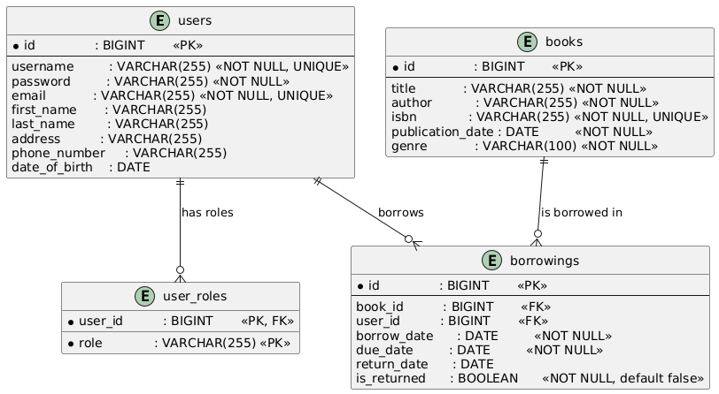

# Getir Bootcamp Library Management System

[](https://github.com/okturan/getir-bootcamp-library-management-system/actions/workflows/ci.yml)
[](https://adoptium.net/temurin/releases/?version=21)
[](https://spring.io/projects/spring-boot)
[](LICENSE)

A Spring Boot REST API built for Getir's Java bootcamp final assignment. It models a single-copy library with JWT authentication, role-based authorization, borrowing workflows, overdue reporting, and server-sent availability events.

## What it demonstrates

| Capability | Implementation |
| --- | --- |
| Authentication | Registration and login with signed JWT bearer tokens |
| Authorization | `ADMIN`, `LIBRARIAN`, and `PATRON` policies at HTTP and method level |
| Catalog | Book CRUD, ISBN uniqueness, filtering, and paginated queries |
| Circulation | Borrow, return, personal history, active loans, and overdue reports |
| Live updates | Reactor-backed Server-Sent Events when a book's availability changes |
| API usability | OpenAPI/Swagger UI plus an executable Postman collection |
| Persistence | H2 for local development and PostgreSQL for container runs |
| Quality | Unit, repository, controller, security, and full-context integration tests |

The domain is intentionally compact: a book stores its author and genre directly, and each ISBN represents one lendable copy.

## Project status

This is a completed bootcamp reference project, not a hosted production service. There is no public demo or live API. The default mode is designed for local exploration with an in-memory database and clearly marked development credentials. The `prod` profile requires database, admin, and JWT secrets from the environment and does not load mock data.

## Architecture

```text
HTTP / JSON
    |
controllers + OpenAPI contracts
    |
services (authorization and circulation rules)
    |
Spring Data repositories
    |
H2 locally / PostgreSQL in containers

JWT filter -> Spring Security -> role- and ownership-aware endpoints
Book state changes -> Reactor sink -> SSE availability stream
```

```text
src/main/java/com/okturan/getirbootcamplibrarymanagementsystem
├── bootstrap      # local admin and optional mock-data initialization
├── config         # Spring Security and OpenAPI configuration
├── controller     # REST endpoints and API contracts
├── dto            # request/response boundaries
├── mapper         # MapStruct entity/DTO mapping
├── model          # JPA entities and roles
├── repository     # Spring Data queries
├── security       # JWT parsing and request authentication
└── service        # application and circulation rules
```

### Data model



## Run locally

Requirements: Java 21. The Maven wrapper downloads the pinned Maven 3.9.9 distribution on first use.

```bash
git clone https://github.com/okturan/getir-bootcamp-library-management-system.git
cd getir-bootcamp-library-management-system
./mvnw spring-boot:run
```

The API starts at `http://localhost:8080` with an in-memory H2 database and sample records.

| Local resource | URL / value |
| --- | --- |
| Swagger UI | <http://localhost:8080/swagger-ui.html> |
| OpenAPI JSON | <http://localhost:8080/v3/api-docs> |
| H2 console | <http://localhost:8080/h2-console> |
| H2 JDBC URL | `jdbc:h2:mem:testdb` |
| Development admin | `admin` / `admin123` |

The development admin and JWT key are intentionally local-only defaults. The `prod` profile overrides them with required environment variables.

## Run with PostgreSQL and Docker

Copy the example environment file, fill its three blank secret values, then start the stack:

```bash
cp .env.example .env
docker compose --env-file .env up --build
```

`compose.yaml` refuses to start when `POSTGRES_PASSWORD`, `ADMIN_PASSWORD`, or `JWT_SECRET` is missing. Generate a strong JWT secret, for example:

```bash
openssl rand -base64 48
```

The Docker configuration uses the `prod` profile, disables sample-data generation, waits for PostgreSQL health, and runs the application as a non-root user. Hibernate schema updates remain enabled by default for this reference project; set `JPA_DDL_AUTO` explicitly if your deployment manages schema changes separately.

## API guide

| Route group | Purpose | Typical access |
| --- | --- | --- |
| `/api/auth` | Register patrons, log in, and create privileged users | Public login/registration; admin for privileged registration |
| `/api/users` | Current-user profile and user administration | Authenticated; elevated operations are role-restricted |
| `/api/books` | Catalog CRUD, search, pagination, and availability stream | Authenticated reads; admin/librarian writes |
| `/api/borrowings` | Borrow/return, history, active/overdue lists, and reports | Authenticated with ownership/role checks |

Import [`postman_collection.json`](postman_collection.json) to exercise the complete workflow. The collection chains generated IDs and tokens; its example JWT values and passwords are non-production fixtures.

## Test and build

```bash
./mvnw --batch-mode --no-transfer-progress verify
```

The suite uses the `test` profile with H2 and mock data disabled. It covers service rules, repositories, controllers, custom security handlers, and full-context MockMvc API flows. For pull requests and pushes to `main`, GitHub Actions runs the same command on Java 21 and builds the application container.

To build the container independently:

```bash
docker build -t library-management-api .
```

## Configuration

Production values are supplied through environment variables; secrets are never given committed production defaults.

| Variable | Required in `prod` | Purpose |
| --- | --- | --- |
| `SPRING_DATASOURCE_URL` | Yes | PostgreSQL JDBC URL |
| `SPRING_DATASOURCE_USERNAME` | Yes | Database role |
| `SPRING_DATASOURCE_PASSWORD` | Yes | Database password |
| `ADMIN_PASSWORD` | Yes | Initial admin password when no admin exists |
| `JWT_SECRET` | Yes | HMAC signing key; use at least 32 random bytes |
| `ADMIN_USERNAME` | No | Initial admin username, default `admin` |
| `ADMIN_EMAIL` | No | Initial admin email |
| `MOCK_DATA_ENABLED` | No | Sample data switch; defaults to `false` in `prod` |
| `JPA_DDL_AUTO` | No | Hibernate schema policy; defaults to `update` for this reference stack |

## Logging and request tracing

Every request receives an `X-Request-ID`. Console logs include that identifier, and local file logs rotate daily or at 10 MB with 30-day retention. Generated logs are ignored by Git.

## License

Licensed under the [MIT License](LICENSE).
